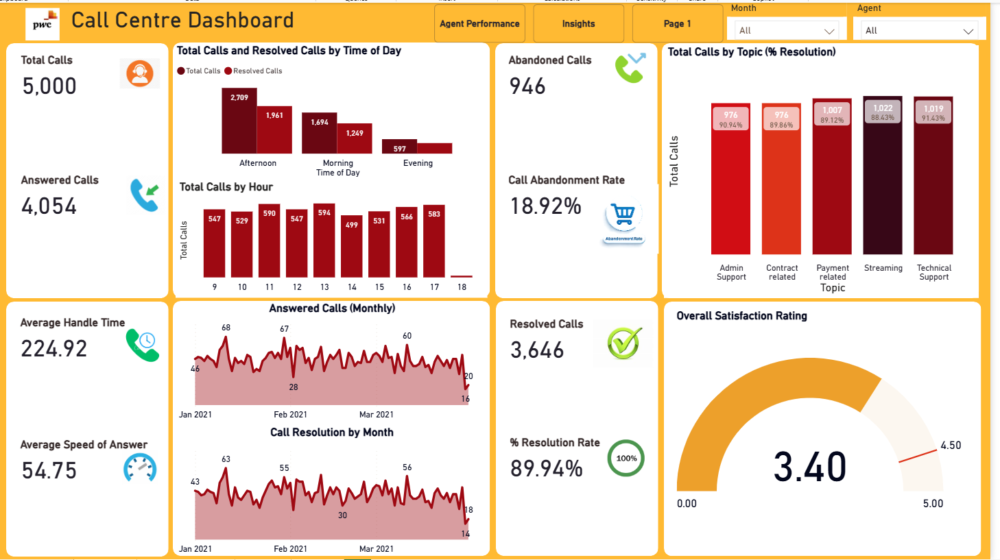
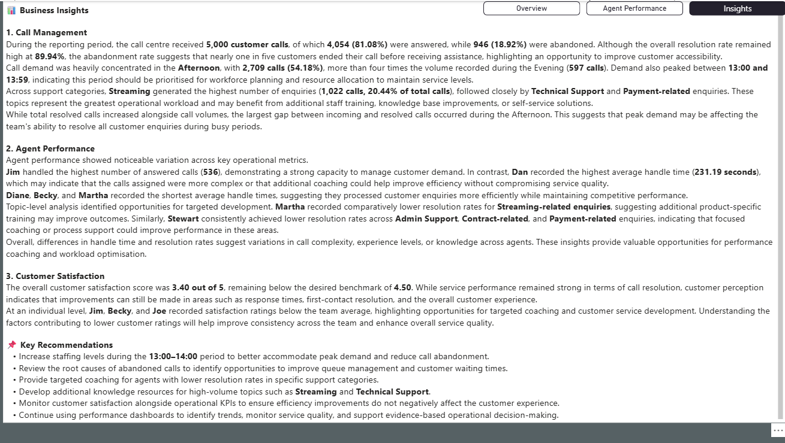

# 📞 Call Centre Performance Dashboard

<p align="center">
  
</p>

<p align="center">


</p>

<p align="center">

**An interactive Power BI dashboard designed to analyse call centre operations, monitor agent performance, and generate actionable business insights.**

</p>

---

# ⭐ Featured Project

This dashboard demonstrates an end-to-end Business Intelligence solution built in **Microsoft Power BI**, transforming raw operational call centre data into meaningful visualisations that support strategic and operational decision-making.

The report enables stakeholders to monitor key performance indicators, evaluate customer service efficiency, compare agent performance, and identify operational improvement opportunities through an intuitive and interactive reporting experience.

---

# 📑 Table of Contents

- [Project Overview](#project-overview)
- [Business Problem](#business-problem)
- [Objectives](#objectives)
- [Dashboard Features](#dashboard-features)
- [Dashboard Pages](#dashboard-pages)
- [Key Performance Indicators](#key-performance-indicators)
- [Dataset](#dataset)
- [Power BI Techniques Used](#power-bi-techniques-used)
- [Business Insights](#business-insights)
- [Business Recommendations](#business-recommendations)
- [Project Structure](#project-structure)
- [Future Improvements](#future-improvements)
- [Author](#author)

---

# 📊 Project Overview

This project analyses operational performance within a call centre using interactive dashboards built in **Microsoft Power BI**.

The solution enables decision-makers to:

- Monitor call centre activity
- Track service quality
- Analyse customer satisfaction
- Evaluate individual agent performance
- Identify peak demand periods
- Improve operational efficiency

---

# 💼 Business Problem

Managing thousands of daily customer interactions can make it difficult for management to identify operational issues using traditional reports.

The objective of this dashboard was to create a single source of truth that provides real-time visibility into:

- Call demand
- Resolution performance
- Customer satisfaction
- Agent productivity
- Operational bottlenecks

---

# 🎯 Objectives

✔ Build an executive performance dashboard

✔ Monitor key operational KPIs

✔ Compare agent performance

✔ Analyse customer satisfaction

✔ Monitor call abandonment

✔ Provide actionable business insights

---

# 🚀 Dashboard Features

- Interactive slicers
- Dynamic KPI cards
- DAX Measures
- Power Query transformations
- Executive dashboard
- Agent performance dashboard
- Business insight reporting
- Time-based trend analysis
- Topic analysis
- Customer satisfaction monitoring

---

# 📸 Dashboard Pages

## Executive Overview

<p align="center">

</p>

The Executive Dashboard provides a high-level overview of operational performance, including:

- Total Calls
- Answered Calls
- Resolved Calls
- Average Handle Time
- Average Speed of Answer
- Call Abandonment Rate
- Resolution Rate
- Customer Satisfaction
- Call Trends
- Topic Performance

---

## Agent Performance

<p align="center">

</p>

The Agent Performance dashboard compares agents across multiple service metrics including:

- Calls handled
- Resolution Rate
- Handle Time
- Speed of Answer
- Customer Satisfaction
- Top Performing Agents
- Lowest Abandonment Rate

---

## Business Insights

## <p align="center">
## 
## </p>

The Insights page summarises key operational findings identified from the analysis and translates dashboard metrics into business recommendations for management.

---

# 📈 Key Performance Indicators

| KPI | Description |
|------|-------------|
| Total Calls | Total customer calls received |
| Answered Calls | Successfully answered calls |
| Resolved Calls | Successfully resolved calls |
| Abandoned Calls | Calls abandoned before answering |
| Resolution Rate | Percentage of resolved calls |
| Abandonment Rate | Percentage of abandoned calls |
| Average Handle Time | Average duration of each call |
| Average Speed of Answer | Average customer waiting time |
| Customer Satisfaction | Overall customer rating |

---

# 🗂 Dataset

The dashboard analyses operational call centre data containing:

- Call Date
- Call Time
- Agent
- Topic
- Answered Status
- Resolved Status
- Handle Time
- Speed of Answer
- Customer Satisfaction Rating

> **Note:** The dataset has been anonymised for portfolio purposes.

---

# ⚙ Power BI Techniques Used

## Data Preparation

- Power Query
- Data Cleaning
- Data Transformation
- Data Modelling

## DAX Measures

Examples include:

- Total Calls
- Resolution Rate
- Average Handle Time
- Average Speed of Answer
- Call Abandonment Rate

## Visualisations

- KPI Cards
- Line Charts
- Clustered Column Charts
- Gauge Charts
- Tables
- Scatter Charts
- Interactive Filters

---

# 💡 Business Insights

Key findings include:

- Afternoon periods experienced the highest call volumes, indicating peak customer demand.
- Streaming and Technical Support generated the largest proportion of customer enquiries.
- Overall resolution rates remained close to **90%**, demonstrating strong operational performance.
- Customer satisfaction averaged **3.40 / 5**, suggesting opportunities to further enhance customer experience.
- Agent performance varied across handle time, response speed, and resolution rates, highlighting opportunities for coaching and workload optimisation.

---

# 📌 Business Recommendations

- Increase staffing during peak afternoon periods.
- Investigate drivers of call abandonment to reduce customer waiting times.
- Review workflows for high-volume support categories.
- Share best practices from top-performing agents.
- Continue monitoring customer satisfaction trends.
- Use dashboard insights to support workforce planning and operational decision-making.

---

# 📁 Project Structure

```
call-centre-powerbi-dashboard
│
├── README.md
├── LICENSE
│
├── images
│   ├── overview.png
│   ├── agent-performance.png
│   └── insights.png
│
├── data
│   └── call_centre_sample.csv
│
└── powerbi
    └── Call Centre Dashboard.pbix
```

---

# 🔮 Future Improvements

Future enhancements could include:

- Power BI Service deployment
- Real-time dashboard refresh
- Predictive call volume forecasting
- AI-powered customer sentiment analysis
- SLA monitoring dashboard
- Drill-through agent profiles
- Mobile-optimised report layout

---

# 👨‍💻 Author

## Johnson Weniaru

**Data Analyst | Business Intelligence Analyst | Power BI Developer**

### Technical Skills

- Power BI
- SQL
- Python
- Excel
- Tableau
- Power Query
- DAX
- Git & GitHub
- Data Visualisation
- Business Intelligence
- Data Analytics

---

⭐ **If you found this project useful, please consider giving it a Star!**
