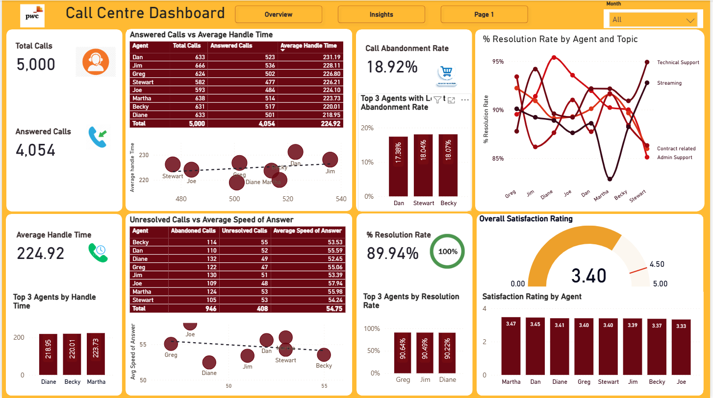

# 📞 Call Centre Performance Dashboard | Power BI

## Overview

This project presents an interactive **Call Centre Performance Dashboard** developed in **Microsoft Power BI** to monitor operational performance, evaluate agent productivity, and uncover actionable business insights. The dashboard consolidates key call centre metrics into an intuitive reporting solution, enabling management to make data-driven decisions that improve customer service and operational efficiency.

The report provides a comprehensive view of call volumes, response times, call resolutions, customer satisfaction, and individual agent performance through interactive visualisations and dynamic filtering.

---

## Business Problem

Call centres generate large volumes of operational data every day. Without an effective reporting solution, it can be difficult for managers to identify performance trends, monitor service levels, and recognise areas requiring operational improvement.

This dashboard was designed to answer key business questions such as:

- How many calls are being received and answered?
- What percentage of calls are successfully resolved?
- Which time of day receives the highest call volume?
- Which agents perform best across key service metrics?
- Which support topics generate the highest workload?
- How satisfied are customers with the service received?

---

## Objectives

The objectives of this project were to:

- Develop an interactive executive dashboard for monitoring call centre KPIs.
- Analyse call trends across different time periods.
- Evaluate individual agent performance.
- Monitor customer satisfaction levels.
- Identify operational bottlenecks and opportunities for improvement.
- Present business insights in a clear and visually engaging format.

---

## Dashboard Pages

### 1. Executive Overview

The Overview page provides senior management with a high-level summary of call centre performance, including:

- Total Calls
- Answered Calls
- Resolved Calls
- Abandoned Calls
- Average Handle Time
- Average Speed of Answer
- Resolution Rate
- Customer Satisfaction Rating
- Call distribution by hour
- Call distribution by topic
- Monthly performance trends

---

### 2. Agent Performance

This page focuses on analysing individual agent performance through metrics including:

- Total Calls handled
- Answered Calls
- Average Handle Time
- Average Speed of Answer
- Resolution Rate
- Top-performing agents
- Agents with the lowest abandonment rate
- Customer satisfaction by agent
- Performance comparison using scatter plots and ranking visuals

---

### 3. Business Insights

The Insights page summarises key findings generated from the dashboard, highlighting operational trends and providing management with actionable recommendations based on the analysed data.

Examples include:

- Peak call periods
- Resolution performance
- Call abandonment trends
- Agent performance observations
- Customer satisfaction analysis

---

## Key Performance Indicators (KPIs)

The dashboard tracks the following KPIs:

- Total Calls
- Answered Calls
- Resolved Calls
- Abandoned Calls
- Resolution Rate (%)
- Call Abandonment Rate (%)
- Average Handle Time
- Average Speed of Answer
- Overall Customer Satisfaction Rating

---

## Dataset

The dataset contains operational call centre information including:

- Call Date
- Time of Call
- Agent
- Call Topic
- Answered Status
- Resolved Status
- Handle Time
- Speed of Answer
- Customer Satisfaction Rating

> **Note:** The dataset used for this project has been anonymised for portfolio purposes.

---

## Tools & Technologies

- Microsoft Power BI
- Power Query
- DAX (Data Analysis Expressions)
- Microsoft Excel

---

## Power BI Features Used

- Data Modelling
- Star Schema Design
- Power Query Data Transformation
- DAX Measures
- Calculated Columns
- KPI Cards
- Interactive Slicers
- Drill-through Navigation
- Dynamic Filtering
- Custom Visual Formatting
- Scatter Charts
- Gauge Charts
- Line Charts
- Column Charts
- Tables
- Business Insight Reporting

---

## Skills Demonstrated

This project demonstrates practical experience in:

- Business Intelligence
- Dashboard Design
- Data Visualisation
- Data Cleaning
- Data Transformation
- Data Modelling
- DAX Development
- KPI Reporting
- Performance Analysis
- Operational Analytics
- Data Storytelling
- Business Insight Generation

---

## Key Insights

Some of the insights obtained from the analysis include:

- Afternoon periods recorded the highest call volumes, indicating peak demand.
- Streaming and Technical Support generated the largest proportion of customer enquiries.
- Overall call resolution remained close to 90%, reflecting strong operational performance.
- Customer satisfaction averaged **3.4 out of 5**, indicating opportunities to improve customer experience.
- Agent performance varied across handle time, response speed, and resolution rate, highlighting opportunities for coaching and workload optimisation.

---

## Business Recommendations

Based on the findings, the following recommendations are proposed:

- Increase staffing during afternoon peak periods.
- Investigate causes of call abandonment and implement strategies to reduce waiting times.
- Review handling processes for high-volume support topics.
- Share best practices from high-performing agents across the wider team.
- Continue monitoring customer satisfaction to identify service improvement opportunities.
- Use dashboard insights to support workforce planning and performance management.

---

## Screenshots

### Executive Overview


---

### Agent Performance



---

### Business Insights

*Insert Insights Screenshot*

---

## Future Improvements

Potential enhancements for future versions include:

- Real-time data integration
- Forecasting using Power BI AI visuals
- Drill-through agent reports
- Service Level Agreement (SLA) tracking
- Predictive analysis of call demand
- Customer sentiment analysis
- Automated report refresh using Power BI Service

---

## Repository Structure

```
Call-Centre-PowerBI-Dashboard/
│
├── data/
│   └── call_centre_sample_data.csv
│
├── images/
│   ├── overview.png
│   ├── agent-performance.png
│   └── insights.png
│
├── powerbi/
│   └── Call Centre Dashboard.pbix
│
├── README.md
└── LICENSE
```

---

## Author

**Johnson Weniaru**

Data Analyst | Business Intelligence Analyst | Power BI Developer

**Skills**

- Power BI
- SQL
- Python
- Excel
- Tableau
- Data Analytics
- Business Intelligence
- Data Visualisation

---

If you found this project interesting, feel free to connect with me on LinkedIn or explore my other analytics projects.
